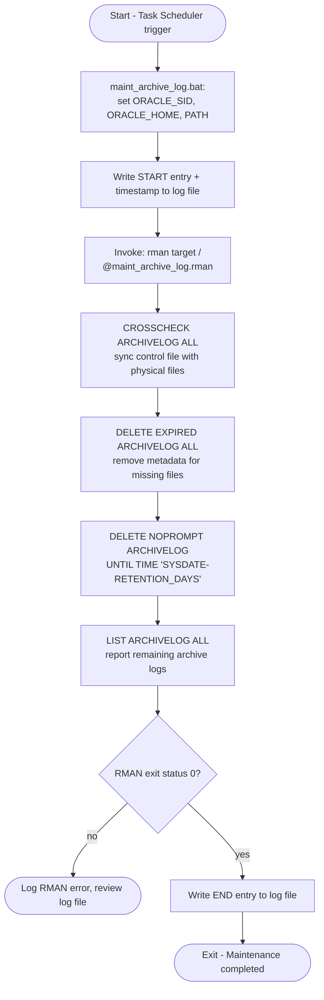
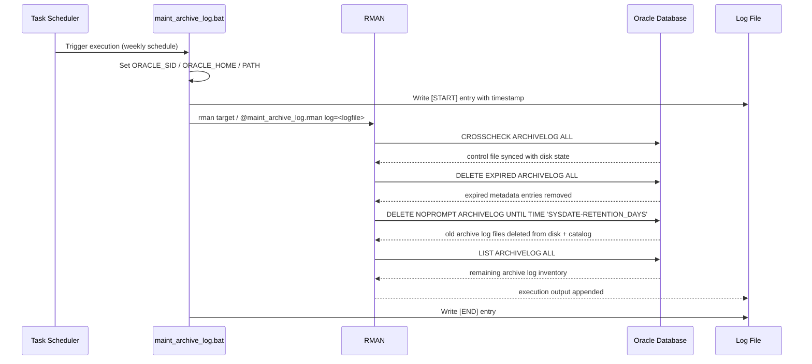

# Automatic Maintenance of Oracle Archive Log Files for Oracle Database 11g (ORCLDB) on Windows

This document describes the archive log maintenance procedure using the RMAN script `maint_archive_log.rman` together with the wrapper batch file `maint_archive_log.bat` (version 1.0) for Oracle Database 11g running on Microsoft Windows. The script synchronizes archive log metadata with the physical files on disk, removes expired metadata entries, and deletes archive log files older than a configurable retention period (default: 7 days) using RMAN. Execution is logged to a timestamped `.log` file and can be automated with Windows Task Scheduler.

> **Note:** All host names, SIDs, paths, and credentials shown in this document are placeholders. Replace them with your actual environment values before use.

> **⚠️ Destructive operation enabled by default** — `DELETE NOPROMPT ARCHIVELOG UNTIL TIME 'SYSDATE-7'` removes archive log files without an interactive confirmation prompt. Review the Design Notes section below before deploying.

---

## Script Information

| Field         | Value                                            |
|----------------|---------------------------------------------------|
| Company        | Company Name (Example)                            |
| Author         | Kusnandar R                                       |
| Email          | seeomkus@gmail.com                                |
| Created Date   | 2025-05-08                                        |
| Last Update    | 2025-05-08                                        |
| File Name      | `maint_archive_log.rman`, `maint_archive_log.bat` |
| Version        | 1.0                                               |
| Function       | Synchronize and delete Oracle Archive Log files older than retention period |
| Database       | Oracle 11g on Microsoft Windows                   |
| Target         | `ORCLDB`                                          |

---

## Workflow Diagram



## Sequence Diagram — RMAN Maintenance Flow



---

## Usage

```bat
:: Manual execution
maint_archive_log.bat

:: Scheduled via Windows Task Scheduler (weekly, e.g. Sunday 02:00)
:: Program/script: <SCRIPT_DIRECTORY>\maint_archive_log.bat

:: View log output
type <LOG_DIRECTORY>\arch_maint_YYYYMMDD.log
```

---

## Configuration

### Directory Structure

```
<SCRIPT_DIRECTORY>\
└── maint_archive_log.rman

<LOG_DIRECTORY>\
├── arch_maint.log
└── arch_maint_YYYYMMDD.log

<ORACLE_HOME>\FLASH_RECOVERY_AREA\<ORACLE_SID>\ARCHIVELOG\   ← FRA mode target
```

### Configuration Variables

| Variable                 | Example Value                                              | Description                                    |
|----------------------------|---------------------------------------------------------------|--------------------------------------------------|
| `ORACLE_SID`               | `<YOUR_ORACLE_SID>`                                            | Oracle instance identifier                        |
| `ORACLE_HOME`              | `<YOUR_ORACLE_HOME_PATH>`                                      | Oracle software home                              |
| `LOGFILE`                  | `<LOG_DIRECTORY>\arch_maint_YYYYMMDD.log`                       | Per-run script log (unique date suffix)           |
| `RETENTION_DAYS`           | `7`                                                            | Days to keep archive log files before deletion    |
| `SCRIPT_DIRECTORY`         | `<SCRIPT_DIRECTORY>`                                            | Directory containing `maint_archive_log.rman`     |

---

## Exit Codes

| Code | Description                                        |
|------|-----------------------------------------------------|
| 0    | Success — RMAN maintenance completed normally        |
| Non-zero | Error — RMAN connection failed, or one of the maintenance commands returned an error |

---

## Key Features

- **RMAN-based synchronization** — uses `CROSSCHECK ARCHIVELOG ALL` to reconcile control file metadata with physical archive log files on disk
- **Expired metadata cleanup** — `DELETE EXPIRED ARCHIVELOG ALL` removes catalog entries whose physical files are missing
- **Retention-based deletion** — `DELETE NOPROMPT ARCHIVELOG UNTIL TIME 'SYSDATE-RETENTION_DAYS'` removes archive log files older than the configured retention period **(enabled by default, no prompt)**
- **Inventory reporting** — `LIST ARCHIVELOG ALL` reports the remaining archive logs after cleanup
- **Logging** — every run is logged to a uniquely timestamped `.log` file via the wrapper `.bat` script
- **Automation-ready** — designed to run unattended via Windows Task Scheduler on a weekly cadence

---

## SQL Queries Used

```sql
-- Check archive log completion status for a given date
SELECT
    TO_CHAR(COMPLETION_TIME, 'YYYY-MM-DD HH24:MI:SS') AS TIME_COMPLETED,
    NAME
FROM V$ARCHIVED_LOG
WHERE TO_CHAR(COMPLETION_TIME, 'YYYY-MM-DD') = '<TARGET_DATE>'
ORDER BY COMPLETION_TIME;

-- Check Fast Recovery Area (FRA) space usage
SELECT
    SPACE_LIMIT/1024/1024 AS MB_LIMIT,
    SPACE_USED/1024/1024  AS MB_USED
FROM V$RECOVERY_FILE_DEST;
```

| Column | Description |
|---|---|
| `TIME_COMPLETED` | Timestamp when the archive log was completed/written |
| `NAME` | Full path/filename of the archive log |
| `MB_LIMIT` | Total space limit allocated to the FRA (in MB) |
| `MB_USED` | Space currently used within the FRA (in MB) |

---

## Log Files

**Log Path:** `<LOG_DIRECTORY>\arch_maint_YYYYMMDD.log`

Format: `[START]/[END] tag, date/time, RMAN command output`

Each run creates a new log file with a unique date-based suffix; a rolling summary is also appended to `arch_maint.log`.

---

## Design Notes

- Archive log retention is controlled by a single `RETENTION_DAYS` value (default 7) applied via `SYSDATE-RETENTION_DAYS`; adjust to match local backup/retention policy before scheduling.
- **Deletion is enabled by default** — `DELETE NOPROMPT ARCHIVELOG` executes without an interactive confirmation, as long as the archive log has already been backed up (per RMAN's default archival log deletion policy). Verify `RETENTION_DAYS` and test in a non-production environment before scheduling this script.
- `CROSSCHECK ARCHIVELOG ALL` and `DELETE EXPIRED ARCHIVELOG ALL` run **before** the retention-based deletion, so catalog metadata stays consistent with what is physically present on disk prior to removal.
- The `.bat` wrapper is responsible for environment setup (`ORACLE_SID`, `ORACLE_HOME`, `PATH`) and logging; the `.rman` script contains only RMAN commands, keeping the two concerns separated.

---

## Error Handling

| Error Condition               | Action                                             |
|-------------------------------|------------------------------------------------------|
| RMAN cannot connect (`target /`) | RMAN returns non-zero exit status, logged to `.log` file |
| Archive log referenced in catalog but missing on disk | Cleared by `DELETE EXPIRED ARCHIVELOG ALL` |
| Archive log not yet backed up | Excluded from deletion by RMAN's archival deletion policy |
| Log directory not accessible  | Batch script fails to write log entries; verify directory permissions |

---

## Troubleshooting

| Issue                        | Solution                                                              |
|------------------------------|-----------------------------------------------------------------------|
| Script fails to start        | Verify DB is running; check `ORACLE_HOME` and `ORACLE_SID` in `.bat`  |
| `rman` executable not found  | Verify `ORACLE_HOME\bin` is on `PATH` and points to a valid install   |
| RMAN maintenance fails       | Check RMAN connectivity, verify SYSDBA privileges, review log output  |
| Archive logs not being deleted | Confirm logs have been backed up per RMAN deletion policy; check `RETENTION_DAYS` |
| FRA space usage still high   | Verify `RETENTION_DAYS`; check FRA allocation via `V$RECOVERY_FILE_DEST` |

---

## Permissions Required

- Script files (`maint_archive_log.bat`, `maint_archive_log.rman`): accessible by the Windows service account running the scheduled task
- Read/write access to the log directory (`<LOG_DIRECTORY>`)
- Read/write access to the archive log destination (FRA or traditional filesystem path)
- Oracle `sysdba` access for RMAN operations
- Read access to `V$ARCHIVED_LOG`, `V$RECOVERY_FILE_DEST`

---

## Script File: maint_archive_log.rman

```sql
-- Synchronize control file with physical archive log files
CROSSCHECK ARCHIVELOG ALL;

-- Remove metadata for archive logs whose physical files are missing
DELETE EXPIRED ARCHIVELOG ALL;

-- Remove archive logs older than retention period (default: 7 days)
DELETE NOPROMPT ARCHIVELOG UNTIL TIME 'SYSDATE-7';

-- List all remaining archive logs
LIST ARCHIVELOG ALL;
```

## Script File: maint_archive_log.bat

```bat
@echo off
REM ==============================================================
REM Company Name (Example)
REM Created date: 2025-05-08
REM Author by   : Kusnandar R
REM Email       : seeomkus@gmail.com
REM File Name   : maint_archive_log.bat
REM Version     : 1.0
REM Function    : Wrapper script to run RMAN archive log maintenance
REM Database    : Oracle 11g on Microsoft Windows
REM Target      : ORCLDB
REM Last Updated: 2025-05-08
REM ==============================================================

set ORACLE_SID=<YOUR_ORACLE_SID>
set ORACLE_HOME=<YOUR_ORACLE_HOME_PATH>
set PATH=%ORACLE_HOME%\bin;%PATH%

echo [START] Archive log maintenance >> <LOG_DIRECTORY>\arch_maint.log
echo %date% %time% >> <LOG_DIRECTORY>\arch_maint.log

rman target / @<SCRIPT_DIRECTORY>\maint_archive_log.rman log=<LOG_DIRECTORY>\arch_maint_%date:~10,4%%date:~4,2%%date:~7,2%.log

echo [END] Maintenance done. >> <LOG_DIRECTORY>\arch_maint.log
echo. >> <LOG_DIRECTORY>\arch_maint.log
```

---

> **End of Document**
