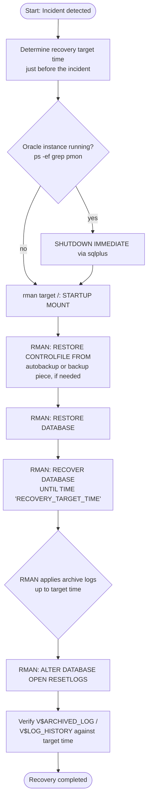
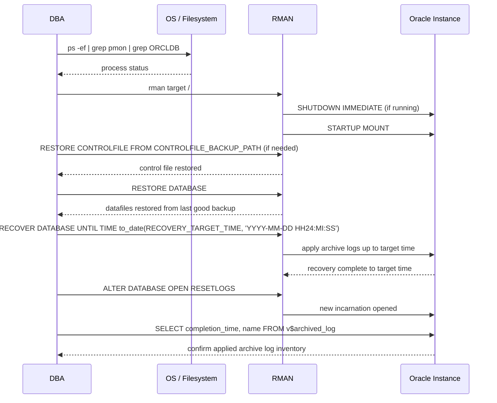

# Recovery Database Before Crash for Oracle Database 11g (ORCLDB) on Oracle Linux 6

This document describes a complete, step-by-step procedure for recovering the `ORCLDB` database to the point in time immediately before a crash or user error (e.g., accidental `DROP TABLE` / `DELETE`), using RMAN and archive log files on Oracle 11g running on Oracle Linux 6. The procedure restores the datafiles/backup taken before the incident, then applies archive logs up to a target time just before the error occurred, using RMAN's `RECOVER DATABASE UNTIL TIME`.

> **Note:** All host names, SIDs, paths, dates, and credentials shown in this document are placeholders. Replace them with your actual environment values before use.

> **⚠️ This is an incomplete recovery procedure** — `ALTER DATABASE OPEN RESETLOGS` permanently discards any transactions committed after the recovery target time. Always confirm the target time and available archive logs before opening the database.

---

## Scenario Information

| Field                | Value                                                        |
|----------------------|---------------------------------------------------------------|
| Company              | Company Name (Example)                                        |
| Author               | Kusnandar R                                                    |
| Email                | seeomkus@gmail.com                                             |
| Document Date        | 2026-07-14                                                     |
| Database             | Oracle 11g on Oracle Linux 6                                    |
| Target               | `ORCLDB`                                                        |
| Database Mode        | `ARCHIVELOG`                                                    |
| Incident              | User error / crash (e.g. accidental `DROP TABLE` / `DELETE`)   |
| Recovery Target Time  | Just before incident time (example: `2026-07-14 10:25:00`)      |

### Prerequisites

- Database running in `ARCHIVELOG` mode
- A valid RMAN backup (datafiles + control file) taken **before** the incident occurred
- A complete set of archive log files up to the incident time, accessible from the RMAN backup location or FRA

---

## Workflow Diagram



## Sequence Diagram — RMAN Incomplete Recovery Flow



---

## Recovery Procedure

### 1. Determine the Target Recovery Time

Identify the exact time the error occurred and target the recovery a few minutes earlier:

```
<RECOVERY_TARGET_TIME>   -- e.g. 2026-07-14 10:25:00
```

### 2. Shut Down and Mount the Database

```bash
export ORACLE_HOME=<YOUR_ORACLE_HOME_PATH>
export ORACLE_SID=<YOUR_ORACLE_SID>
export PATH=$ORACLE_HOME/bin:$PATH

$ORACLE_HOME/bin/rman target /
```

```sql
SHUTDOWN IMMEDIATE;
STARTUP MOUNT;
```

### 3. Restore the Control File (if required) and Database

```sql
-- Only needed if the current control file is unusable or out of sync
RESTORE CONTROLFILE FROM '<CONTROLFILE_BACKUP_PATH>';
ALTER DATABASE MOUNT;

RESTORE DATABASE;
```

### 4. Recover the Database Up to the Target Time

```sql
RUN {
    SET UNTIL TIME "to_date('<RECOVERY_TARGET_TIME>','YYYY-MM-DD HH24:MI:SS')";
    RECOVER DATABASE;
}
```

RMAN automatically locates and applies the required archive logs from the FRA or configured backup location up to the specified time.

### 5. Open the Database with RESETLOGS

```sql
ALTER DATABASE OPEN RESETLOGS;
```

### 6. Verify the Recovery

```sql
SELECT
    TO_CHAR(COMPLETION_TIME, 'YYYY-MM-DD HH24:MI:SS') AS TIME_COMPLETED,
    NAME
FROM V$ARCHIVED_LOG
WHERE TO_CHAR(COMPLETION_TIME, 'YYYY-MM-DD') = '<TARGET_DATE>'
ORDER BY COMPLETION_TIME;
```

Confirm the last applied archive log corresponds to the intended recovery target time.

---

## Key Features

- **RMAN-driven incomplete recovery** — `SET UNTIL TIME` + `RECOVER DATABASE` automates archive log discovery and application, unlike the manual file-by-file prompt flow used on Windows/SQL*Plus
- **Automatic archive log retrieval** — RMAN locates required archive logs from the FRA or configured backup destination without manual path entry
- **Control file restore support** — `RESTORE CONTROLFILE FROM` handles cases where the current control file is unusable after a failure
- **Verification step** — `V$ARCHIVED_LOG` is queried after recovery to confirm the correct archive logs were applied

---

## SQL Queries Used

```sql
-- Check archive log completion status for a target date
SELECT
    TO_CHAR(COMPLETION_TIME, 'YYYY-MM-DD HH24:MI:SS') AS TIME_COMPLETED,
    NAME
FROM V$ARCHIVED_LOG
WHERE TO_CHAR(COMPLETION_TIME, 'YYYY-MM-DD') = '<TARGET_DATE>'
ORDER BY COMPLETION_TIME;
```

---

## Design Notes

- Unlike the Windows/SQL*Plus procedure (which uses `RECOVER DATABASE UNTIL CANCEL` and manual archive log prompts), this Linux/RMAN variant uses `SET UNTIL TIME` so RMAN automates archive log discovery and application — appropriate when the FRA or backup catalog already has the required archive logs available.
- This 11g variant connects with a minimal environment setup (`ORACLE_HOME`, `ORACLE_SID`, `PATH`) and invokes `$ORACLE_HOME/bin/rman` directly, consistent with the lighter-weight convention used for other 11g scripts in this environment.
- `RESTORE CONTROLFILE` is only required when the control file itself is lost or inconsistent; if the existing control file is still valid, skip directly to `RESTORE DATABASE` / `RECOVER DATABASE`.
- `ALTER DATABASE OPEN RESETLOGS` creates a new incarnation of the database — schedule a fresh full backup immediately after recovery completes.

---

## Error Handling / Troubleshooting

| Issue                                   | Action / Solution                                                       |
|------------------------------------------|---------------------------------------------------------------------------|
| RMAN cannot find required archive logs   | Verify FRA or backup destination contains logs up to the target time     |
| `RECOVER DATABASE` fails partway through | Confirm database is in `MOUNT` state and datafiles were fully restored    |
| Recovered too far past the incident      | Re-run `RESTORE DATABASE` and retry with an earlier `UNTIL TIME` value    |
| `ALTER DATABASE OPEN RESETLOGS` fails    | Confirm recovery completed without errors; check alert log for details   |
| Archive log inventory after recovery doesn't match expectation | Review RMAN output log for skipped or unavailable archive log sequences |

---

## Permissions Required

- Oracle `sysdba` access for RMAN operations (`SHUTDOWN`, `STARTUP MOUNT`, `RESTORE`, `RECOVER`, `ALTER DATABASE OPEN RESETLOGS`)
- Read access to the RMAN backup location and FRA archive log directory
- OS-level access to the Oracle Linux 6 host running the `ORCLDB` instance

---

> **End of Document**
