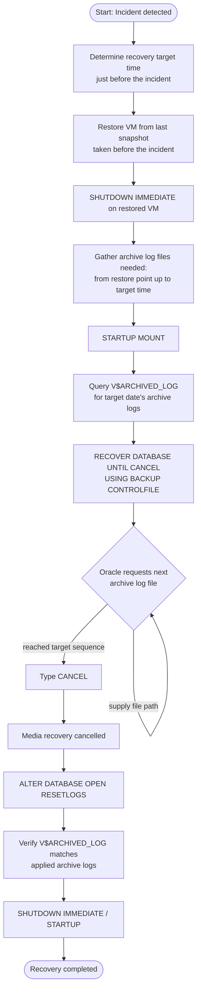
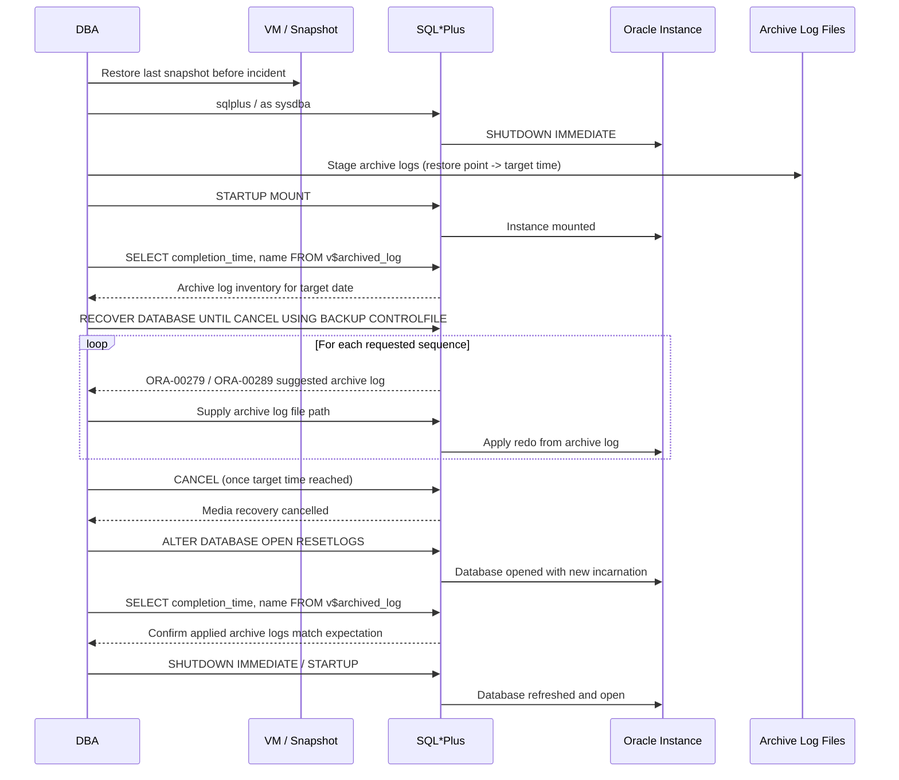

# Recovery Database Before Crash for Oracle Database 11g (ORCLDB) on Ms Windows

This document describes a complete, step-by-step simulation for recovering the `ORCLDB` database to the point in time immediately before a crash or user error (e.g., accidental `DROP TABLE` / `DELETE`), using SQL*Plus and archive log files on Oracle 11g (Windows). The procedure restores the VM from the last snapshot taken before the incident, then applies archive logs up to a target time just before the error occurred, using incomplete (point-in-time) recovery with `RECOVER DATABASE UNTIL CANCEL`.

> **Note:** All host names, SIDs, paths, dates, and credentials shown in this document are placeholders. Replace them with your actual environment values before use.

> **⚠️ This is an incomplete recovery procedure** — `ALTER DATABASE OPEN RESETLOGS` permanently discards any transactions committed after the recovery target time. Always confirm the target time and available archive logs before opening the database.

---

## Scenario Information

| Field                | Value                                                        |
|----------------------|---------------------------------------------------------------|
| Company              | Company Name (Example)                                        |
| Author               | Kusnandar R                                                    |
| Email                | seeomkus@gmail.com                                             |
| Document Date        | 2026-07-14                                                     |
| Database             | Oracle 11g on Microsoft Windows                                 |
| Target               | `ORCLDB`                                                        |
| Database Mode        | `ARCHIVELOG`                                                    |
| Incident              | User error / crash (e.g. accidental `DROP TABLE` / `DELETE`)   |
| Incident Time         | `<INCIDENT_DATE> <INCIDENT_TIME>` (example: `2026-07-14 10:30`) |
| Recovery Target Time  | Just before incident time (example: `2026-07-14 10:25`)         |

### Prerequisites

- Database running in `ARCHIVELOG` mode
- A VM snapshot backup taken **before** the incident occurred
- A complete set of archive log files up to the incident time

---

## Workflow Diagram



## Sequence Diagram — Point-in-Time Recovery Flow



---

## Recovery Procedure

### 1. Determine the Target Recovery Time

Identify the exact time the error occurred (example: `<INCIDENT_DATE> <INCIDENT_TIME>`, e.g. `2026-07-14 10:30`). Target the recovery to a few minutes before that time, or to the last complete archive log before the incident:

```
<RECOVERY_TARGET_TIME>   -- e.g. 2026-07-14 10:25:00
```

### 2. Restore VM from the Last Snapshot Before the Incident

```sql
-- After restoring the VM, shut down the Oracle instance on the restored server
sqlplus / as sysdba
SHUTDOWN IMMEDIATE;

-- Stage the archive log files needed for recovery:
-- from the restore point up to just before the incident time,
-- copied from the backup/archive server
```

### 3. Start the Database in MOUNT Mode

```sql
sqlplus / as sysdba
STARTUP MOUNT;
```

### 4. Recover Up to the Target Time (Database in MOUNT State)

Check which archive logs are available after the VM restore, and confirm the corresponding physical files exist:

```sql
SELECT
    TO_CHAR(COMPLETION_TIME, 'YYYY-MM-DD HH24:MI:SS') AS TIME_COMPLETED,
    NAME
FROM V$ARCHIVED_LOG
WHERE
    TO_CHAR(COMPLETION_TIME, 'YYYY-MM-DD') = '<TARGET_DATE>'
ORDER BY COMPLETION_TIME;
```

Start the point-in-time recovery using `BACKUP CONTROLFILE`:

```sql
RECOVER DATABASE UNTIL CANCEL USING BACKUP CONTROLFILE;
```

Example prompt/response sequence during recovery:

```
ORA-00279: change <CHANGE_NUM> generated at <DATE> <TIME> needed for thread 1
ORA-00289: suggestion :
<SUGGESTED_ARCHIVE_LOG_PATH>
ORA-00280: change <CHANGE_NUM> for thread 1 is in sequence #<SEQ_N>

Specify log: {<RET>=suggested | filename | AUTO | CANCEL}
```

Supply the archive log path requested by Oracle:

```
<ARCHIVE_LOG_STAGING_PATH>\<ARCHIVE_LOG_FILE_SEQ_N>
```

Repeat for each subsequent sequence number requested. Once the archive log sequence reaches or passes the target recovery time, respond with `CANCEL` instead of supplying another file:

```
Specify log: {<RET>=suggested | filename | AUTO | CANCEL}
cancel
```

Expected output after cancelling:

```
Media recovery cancelled.
```

### 5. Open the Database

```sql
ALTER DATABASE OPEN RESETLOGS;

-- Verify the archive log inventory after recovery
SELECT
    TO_CHAR(COMPLETION_TIME, 'YYYY-MM-DD HH24:MI:SS') AS TIME_COMPLETED,
    NAME
FROM V$ARCHIVED_LOG
WHERE
    TO_CHAR(COMPLETION_TIME, 'YYYY-MM-DD') = '<TARGET_DATE>'
ORDER BY COMPLETION_TIME;

-- Refresh the database
SHUTDOWN IMMEDIATE;
STARTUP;
```

If the archive log inventory matches what was supplied during recovery, the point-in-time recovery has completed successfully.

---

## Key Features

- **Point-in-time recovery** — restores the database to a specific moment before data loss or corruption occurred
- **VM snapshot + archive log combination** — snapshot provides the baseline, archive logs bridge the gap up to the target time
- **`UNTIL CANCEL` control** — allows the DBA to stop recovery precisely at the desired archive log sequence rather than a fixed timestamp
- **`BACKUP CONTROLFILE` recovery** — used when the current control file does not match the restored datafiles (typical after a VM/snapshot restore)
- **Verification step** — `V$ARCHIVED_LOG` is queried both before and after recovery to confirm the correct archive logs were applied

---

## SQL Queries Used

```sql
-- Check archive log completion status for a target date
SELECT
    TO_CHAR(COMPLETION_TIME, 'YYYY-MM-DD HH24:MI:SS') AS TIME_COMPLETED,
    NAME
FROM V$ARCHIVED_LOG
WHERE TO_CHAR(COMPLETION_TIME, 'YYYY-MM-DD') = '<TARGET_DATE>'
ORDER BY COMPLETION_TIME;
```

| Column | Description |
|---|---|
| `TIME_COMPLETED` | Timestamp when the archive log was completed/written |
| `NAME` | Full path/filename of the archive log |

---

## Design Notes

- Recovery uses `USING BACKUP CONTROLFILE` because the restored VM's control file is out of sync with the archive logs staged from the backup server — this is expected after a snapshot-based restore.
- `UNTIL CANCEL` (rather than `UNTIL TIME '<timestamp>'`) is used so the DBA can visually confirm each archive log sequence before deciding whether to keep applying redo or stop — useful when the exact last-good transaction time is uncertain.
- `ALTER DATABASE OPEN RESETLOGS` creates a new incarnation of the database and invalidates any archive logs generated after the original incident — plan backups accordingly after recovery completes.
- This procedure is destructive to any data/transactions committed after the recovery target time; always validate the target time with application/business stakeholders before proceeding.

---

## Error Handling / Troubleshooting

| Issue                                   | Action / Solution                                                       |
|------------------------------------------|---------------------------------------------------------------------------|
| Oracle repeatedly requests an archive log that doesn't exist | Verify the archive log staging path and confirm the file was copied from the backup server |
| `RECOVER DATABASE` fails to start        | Confirm database is in `MOUNT` state and control file is accessible       |
| Recovered too far past the incident      | Restart recovery from the VM snapshot and stop (`CANCEL`) at an earlier sequence |
| `ALTER DATABASE OPEN RESETLOGS` fails    | Confirm all required archive logs were applied and recovery was properly cancelled, not aborted |
| Archive log inventory after recovery doesn't match expectation | Investigate whether an intermediate archive log was skipped during the recovery prompts |

---

## Permissions Required

- Oracle `sysdba` access on the restored VM for `SHUTDOWN`, `STARTUP MOUNT`, `RECOVER DATABASE`, and `ALTER DATABASE OPEN RESETLOGS`
- Read access to the archive log staging directory on the restored VM
- Access to the backup/archive server to retrieve archive log files up to the incident time
- VM-level restore permissions to roll back to the pre-incident snapshot

---

> **End of Document**
