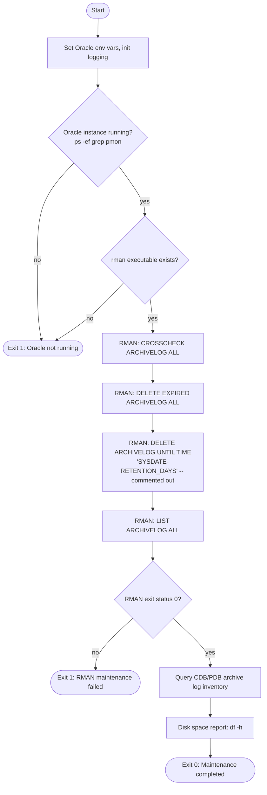
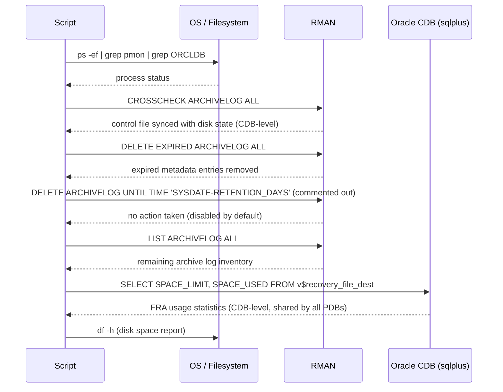

# Automatic Maintenance of Oracle Archive Log Files for Oracle Database 12c (ORCLDB) on Oracle Linux 7

This document describes the archive log maintenance script `maint_archivelog_oradb12c.sh` (version 1.0) for Oracle Database 12c running on Oracle Linux 7. The script synchronizes archive log metadata with the physical files on disk, removes expired metadata entries, and deletes archive log files older than a configurable retention period (default: 7 days) using RMAN. Execution is logged to a timestamped `.log` file.

> **Note:** All host names, SIDs, paths, and credentials shown in this document are placeholders. Replace them with your actual environment values before use.

> **⚠️ Destructive operation is DISABLED by default in this script** — the retention-based `DELETE ARCHIVELOG` command is commented out for safety. Review the Design Notes section below before enabling it.

---

## Script Information

| Field         | Value                                            |
|----------------|---------------------------------------------------|
| Company        | Company Name (Example)                            |
| Author         | Kusnandar R                                       |
| Email          | seeomkus@gmail.com                                |
| Created Date   | 2026-02-16                                        |
| Last Update    | 2026-02-16                                        |
| File Name      | `maint_archivelog_oradb12c.sh`                    |
| Version        | 1.0                                               |
| Function       | Synchronize and delete Oracle Archive Log files older than retention period |
| Database       | Oracle 12c on Oracle Linux 7                      |
| Target         | `ORCLDB` (CDB, container `ORCLPDB1`)              |

---

## Workflow Diagram



## Sequence Diagram — RMAN Maintenance Flow (CDB-aware)



---

## Usage

```bash
# Set executable permission (first time only)
chmod +x maint_archivelog_oradb12c.sh

# Manual execution
./maint_archivelog_oradb12c.sh

# Automated via cron (weekly, Sunday at 2:00 AM)
0 2 * * 0 /path/to/maint_archivelog_oradb12c.sh

# View live log output
tail -f /mnt/log_disk/logs/archive_maint_*.log
```

---

## Configuration

### Directory Structure

```
/mnt/log_disk/logs/
└── archive_maint_YYYYMMDD_HHMMSS.log

/mnt/backup_disk/fast_recovery_area/ORCLDB/archivelog/   ← FRA mode target (CDB-level)
```

### Configuration Variables

| Variable                 | Example Value                                              | Description                                    |
|----------------------------|---------------------------------------------------------------|--------------------------------------------------|
| `ORACLE_HOME`               | `/u01/app/oracle/product/12.2.0/dbhome_1`                      | Oracle software home                              |
| `ORACLE_SID`                | `ORCLDB`                                                       | Oracle CDB instance identifier                    |
| `LOGFILE`                   | `/mnt/log_disk/logs/archive_maint_$(date +%Y%m%d_%H%M%S).log`  | Per-run script log (unique timestamp)             |
| `RETENTION_DAYS`            | `7`                                                            | Days to keep archive logs before deletion         |
| `ARCHIVE_LOG_LOCATION`      | `/mnt/backup_disk/fast_recovery_area/ORCLDB/archivelog`         | FRA archive log path                              |

---

## Exit Codes

| Code | Description                                        |
|------|-----------------------------------------------------|
| 0    | Success — maintenance completed normally             |
| 1    | Error — database not running, `rman` binary missing, or RMAN maintenance failed |

---

## Key Features

- **RMAN-based synchronization** — `CROSSCHECK ARCHIVELOG ALL` reconciles control file metadata with physical archive log files on disk at the CDB level
- **Expired metadata cleanup** — `DELETE EXPIRED ARCHIVELOG ALL` removes catalog entries whose physical files are missing
- **Retention-based deletion (disabled by default)** — `DELETE ARCHIVELOG UNTIL TIME 'SYSDATE-RETENTION_DAYS'` is present but commented out for safety
- **Inventory reporting** — `LIST ARCHIVELOG ALL` reports the remaining archive logs after each run
- **CDB/PDB-aware FRA reporting** — archive log destination and FRA usage are managed at the CDB (root container) level, shared across all pluggable databases
- **Disk space reporting** — logs current disk usage of the FRA or archive path after maintenance

---

## SQL Queries Used

```sql
-- FRA space usage (CDB root)
SELECT
    SPACE_LIMIT/1024/1024 AS MB_LIMIT,
    SPACE_USED/1024/1024  AS MB_USED
FROM V$RECOVERY_FILE_DEST;

-- Archive log inventory for a given date (CDB level)
SELECT
    TO_CHAR(COMPLETION_TIME, 'YYYY-MM-DD HH24:MI:SS') AS TIME_COMPLETED,
    NAME
FROM V$ARCHIVED_LOG
WHERE TO_CHAR(COMPLETION_TIME, 'YYYY-MM-DD') = '<TARGET_DATE>'
ORDER BY COMPLETION_TIME;

-- Confirm container context (should return CDB$ROOT)
SELECT SYS_CONTEXT('USERENV', 'CON_NAME') FROM DUAL;
```

---

## Log Files

**Log Path:** `/mnt/log_disk/logs/archive_maint_YYYYMMDD_HHMMSS.log`

Format: `YYYY-MM-DD HH:MM:SS - Message`

Each run creates a new log file with a unique timestamp.

---

## Design Notes

- In a Container Database (CDB) architecture, archive log generation and the Fast Recovery Area are managed at the **CDB root** level (`CDB$ROOT`), not per-PDB — RMAN must connect with `target /` against the CDB instance, not an individual PDB service.
- Retention is controlled by a single `RETENTION_DAYS` variable (default 7), applied via `SYSDATE-RETENTION_DAYS`.
- **Deletion is disabled by default** — the `DELETE ARCHIVELOG UNTIL TIME` line is commented out; only `CROSSCHECK` and `DELETE EXPIRED` run unconditionally. Uncomment the deletion line only after confirming the retention window is correct for your backup policy.
- `CROSSCHECK ARCHIVELOG ALL` and `DELETE EXPIRED ARCHIVELOG ALL` run **before** any retention-based deletion, keeping catalog metadata consistent with what is physically present on disk.

---

## Error Handling

| Error Condition               | Action                                             |
|-------------------------------|------------------------------------------------------|
| Oracle database not running   | Exit with status 1                                    |
| `rman` binary not found       | Exit with status 1                                    |
| RMAN maintenance failure      | Exit with status 1, log RMAN status code               |
| FRA path not accessible       | Warning logged, FRA reporting steps skipped             |
| Connected to PDB instead of CDB root | RMAN reports archive log operations as unavailable; verify `ORACLE_SID` targets the CDB |

---

## Troubleshooting

| Issue                        | Solution                                                              |
|------------------------------|-----------------------------------------------------------------------|
| Script fails to start        | Verify DB is running; check `ORACLE_HOME` and `ORACLE_SID`           |
| `rman` executable not found  | Verify `ORACLE_HOME` points to a valid Oracle install                |
| RMAN maintenance fails       | Check RMAN connectivity, verify SYSDBA privileges, review log output |
| Disk space still high        | Enable the commented-out `DELETE ARCHIVELOG` line after verification |
| Archive logs not being deleted | Confirm logs are already backed up per RMAN's deletion policy       |
| Unexpected container context | Confirm connection targets `CDB$ROOT`, not a PDB service              |

---

## Permissions Required

- Script file: owned by Oracle user, permission `750`
- Read/write access to log directory (`/mnt/log_disk/logs`)
- Read/write access to FRA archive log directory (`/mnt/backup_disk/fast_recovery_area/ORCLDB/archivelog`)
- Oracle `sysdba` access at the CDB root level for RMAN and SQL*Plus operations
- Read access to `v$parameter`, `v$recovery_file_dest`, `v$archived_log`

---

## Script File: maint_archivelog_oradb12c.sh

```bash
#!/bin/bash
################################################################################
# Company Name (Example)
# Created date: 2026-02-16
# Author by   : Kusnandar R
# Email       : seeomkus@gmail.com
# File Name   : maint_archivelog_oradb12c.sh
# Version     : 1.0
# Function    : Maintenance script to crosscheck, clean expired metadata, and
#               optionally delete Oracle Archive Log files older than 7 days
# Database    : Oracle 12c (CDB) on Oracle Linux 7
# Target      : ORCLDB (CDB$ROOT)
# Last Updated: 2026-02-16
#
# Version History:
# v1.0 (2026-02-16) - Initial release
#                   - CROSSCHECK / DELETE EXPIRED functionality
#                   - CDB-level archive log handling
#                   - Retention-based deletion present but commented out
################################################################################

# Set Oracle Environment Variables
export ORACLE_HOME=/u01/app/oracle/product/12.2.0/dbhome_1
export ORACLE_SID=ORCLDB
export ORACLE_BASE=/u01/app/oracle
export PATH=$ORACLE_HOME/bin:$PATH
export LD_LIBRARY_PATH=$ORACLE_HOME/lib:/lib:/usr/lib

# Log file location
LOGFILE=/mnt/log_disk/logs/archive_maint_$(date +%Y%m%d_%H%M%S).log
RETENTION_DAYS=7
ARCHIVE_LOG_LOCATION=/mnt/backup_disk/fast_recovery_area/ORCLDB/archivelog

mkdir -p /mnt/log_disk/logs

log_message() {
    echo "$(date '+%Y-%m-%d %H:%M:%S') - $1" | tee -a $LOGFILE
}

log_message "=========================================="
log_message "Archive Log Maintenance Started"
log_message "Database (CDB): ORCLDB"
log_message "Retention Period: $RETENTION_DAYS days"
log_message "=========================================="

# Check if Oracle is running
ps -ef | grep pmon | grep $ORACLE_SID > /dev/null
if [ $? -ne 0 ]; then
    log_message "ERROR: Oracle Database $ORACLE_SID is not running"
    exit 1
fi

if [ ! -f "$ORACLE_HOME/bin/rman" ]; then
    log_message "ERROR: RMAN executable not found at $ORACLE_HOME/bin/rman"
    exit 1
fi

log_message "Oracle Home: $ORACLE_HOME"
log_message "Connecting to RMAN (CDB root) for archive log maintenance..."

rman target / << EOF >> $LOGFILE 2>&1
RUN {
    # Synchronize control file with physical archive log files (CDB level)
    CROSSCHECK ARCHIVELOG ALL;

    # Remove metadata for archive logs whose physical files are missing
    DELETE NOPROMPT EXPIRED ARCHIVELOG ALL;

    # Delete archive logs older than retention period
    # Uncomment the line below after verifying script runs correctly
    # DELETE NOPROMPT ARCHIVELOG UNTIL TIME 'SYSDATE-$RETENTION_DAYS';

    # List all remaining archive logs
    LIST ARCHIVELOG ALL;
}
EXIT;
EOF

RMAN_STATUS=$?

if [ $RMAN_STATUS -eq 0 ]; then
    log_message "RMAN maintenance completed successfully"
else
    log_message "ERROR: RMAN maintenance failed with status $RMAN_STATUS"
    log_message "Check log file for details: $LOGFILE"
    exit 1
fi

# FRA usage report (CDB root)
log_message "Checking Flash Recovery Area usage (CDB root)..."
sqlplus -s / as sysdba << EOF >> $LOGFILE 2>&1
SET PAGESIZE 50 FEEDBACK OFF VERIFY OFF HEADING ON LINESIZE 200
COLUMN mb_limit FORMAT 999,999,999
COLUMN mb_used FORMAT 999,999,999
SELECT SPACE_LIMIT/1024/1024 AS MB_LIMIT,
       SPACE_USED/1024/1024  AS MB_USED
FROM V\$RECOVERY_FILE_DEST;
EXIT;
EOF

if [ -d "$ARCHIVE_LOG_LOCATION" ]; then
    log_message "Archive log location: $ARCHIVE_LOG_LOCATION"
    du -sh $ARCHIVE_LOG_LOCATION 2>/dev/null >> $LOGFILE
fi

log_message "=========================================="
log_message "Current disk space usage:"
df -h "$ARCHIVE_LOG_LOCATION" >> $LOGFILE 2>&1

log_message "=========================================="
log_message "Archive Log Maintenance Completed"
log_message "=========================================="

exit 0
```

---

> **End of Document**
