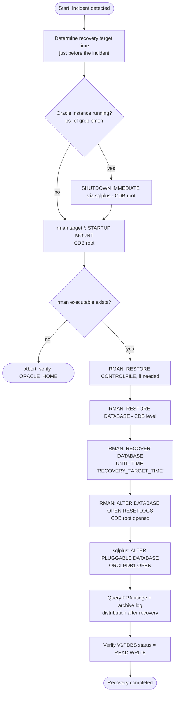

# Recovery Database Before Crash for Oracle Database 19c (ORCLDB) on Oracle Linux 8

This document describes a complete, step-by-step procedure for recovering the `ORCLDB` container database (CDB) to the point in time immediately before a crash or user error (e.g., accidental `DROP TABLE` / `DELETE`), using RMAN and archive log files on Oracle 19c running on Oracle Linux 8. The procedure restores the datafiles/backup taken before the incident, applies archive logs up to a target time, and — because 19c uses a multitenant (CDB/PDB) architecture — explicitly opens the affected pluggable database after the CDB root recovery completes.

> **Note:** All host names, SIDs, paths, dates, and credentials shown in this document are placeholders. Replace them with your actual environment values before use.

> **⚠️ This is an incomplete recovery procedure** — `ALTER DATABASE OPEN RESETLOGS` permanently discards any transactions committed after the recovery target time. Always confirm the target time and available archive logs before opening the database.

---

## Scenario Information

| Field                | Value                                                        |
|----------------------|---------------------------------------------------------------|
| Company              | Company Name (Example)                                        |
| Author               | Kusnandar R                                                    |
| Email                | seeomkus@gmail.com                                             |
| Document Date        | 2026-07-14                                                     |
| Database             | Oracle 19c on Oracle Linux 8                                    |
| Target               | `ORCLDB` (CDB, container `ORCLPDB1`)                             |
| Database Mode        | `ARCHIVELOG`                                                    |
| Incident              | User error / crash affecting pluggable database `ORCLPDB1`      |
| Recovery Target Time  | Just before incident time (example: `2026-07-14 10:25:00`)      |

### Prerequisites

- CDB running in `ARCHIVELOG` mode
- A valid RMAN backup (datafiles + control file) of the CDB taken **before** the incident occurred
- A complete set of archive log files up to the incident time, accessible from the RMAN backup location or FRA

---

## Workflow Diagram



## Sequence Diagram — RMAN Incomplete Recovery Flow (CDB-aware)

```mermaid
sequenceDiagram
    participant DBA as DBA
    participant OS as OS / Filesystem
    participant RMAN as RMAN
    participant CDB as Oracle CDB Instance
    participant PDB as Pluggable Database (ORCLPDB1)

    DBA->>OS: ps -ef | grep pmon | grep ORCLDB
    OS-->>DBA: process status
    DBA->>RMAN: rman target /  (connects to CDB root)
    RMAN->>CDB: SHUTDOWN IMMEDIATE (if running)
    RMAN->>CDB: STARTUP MOUNT
    DBA->>RMAN: RESTORE CONTROLFILE FROM CONTROLFILE_BACKUP_PATH (if needed)
    RMAN-->>DBA: control file restored
    DBA->>RMAN: RESTORE DATABASE
    RMAN-->>DBA: CDB + PDB datafiles restored from last good backup
    DBA->>RMAN: SET UNTIL TIME "..."; RECOVER DATABASE
    RMAN->>CDB: apply archive logs up to target time
    CDB-->>RMAN: recovery complete to target time
    DBA->>RMAN: ALTER DATABASE OPEN RESETLOGS
    RMAN->>CDB: new incarnation opened (root)
    DBA->>CDB: ALTER PLUGGABLE DATABASE ORCLPDB1 OPEN
    CDB->>PDB: PDB opened READ WRITE
    DBA->>CDB: query FRA usage + archive log distribution by day
    CDB-->>DBA: space used/limit, log counts, oldest log
    DBA->>CDB: SELECT name, open_mode FROM v$pdbs
    CDB-->>DBA: confirm ORCLPDB1 = READ WRITE
```

---

## Recovery Procedure

### 1. Determine the Target Recovery Time

```
<RECOVERY_TARGET_TIME>   -- e.g. 2026-07-14 10:25:00
```

### 2. Shut Down and Mount the CDB

```bash
export ORACLE_HOME=<YOUR_ORACLE_HOME_PATH>
export ORACLE_SID=<YOUR_ORACLE_SID>
export ORACLE_BASE=<YOUR_ORACLE_BASE_PATH>
export PATH=$ORACLE_HOME/bin:$PATH
export LD_LIBRARY_PATH=$ORACLE_HOME/lib:/lib:/usr/lib
export CLASSPATH=$ORACLE_HOME/jlib:$ORACLE_HOME/rdbms/jlib

if [ ! -f "$ORACLE_HOME/bin/rman" ]; then
    echo "ERROR: RMAN executable not found at $ORACLE_HOME/bin/rman"
    exit 1
fi

$ORACLE_HOME/bin/rman target /
```

```sql
SHUTDOWN IMMEDIATE;
STARTUP MOUNT;
```

> **Note:** `target /` connects to the CDB root (`CDB$ROOT`) — RMAN recovery operations act on the CDB as a whole, including all pluggable databases whose datafiles need recovery.

### 3. Restore the Control File (if required) and Database

```sql
RESTORE CONTROLFILE FROM '<CONTROLFILE_BACKUP_PATH>';
ALTER DATABASE MOUNT;

RESTORE DATABASE;
```

### 4. Recover the CDB Up to the Target Time

```sql
RUN {
    SET UNTIL TIME "to_date('<RECOVERY_TARGET_TIME>','YYYY-MM-DD HH24:MI:SS')";
    RECOVER DATABASE;
}
```

### 5. Open the CDB Root with RESETLOGS

```sql
ALTER DATABASE OPEN RESETLOGS;
```

### 6. Open the Affected Pluggable Database

```sql
ALTER PLUGGABLE DATABASE ORCLPDB1 OPEN;
```

### 7. Verify the Recovery

```sql
-- Confirm archive log inventory
SELECT
    TO_CHAR(COMPLETION_TIME, 'YYYY-MM-DD HH24:MI:SS') AS TIME_COMPLETED,
    NAME
FROM V$ARCHIVED_LOG
WHERE TO_CHAR(COMPLETION_TIME, 'YYYY-MM-DD') = '<TARGET_DATE>'
ORDER BY COMPLETION_TIME;

-- Confirm PDB is open and read/write
SELECT NAME, OPEN_MODE FROM V$PDBS;

-- Enhanced FRA usage check after recovery
SELECT
    SPACE_USED/1024/1024        AS SPACE_USED_MB,
    SPACE_LIMIT/1024/1024       AS SPACE_LIMIT_MB,
    SPACE_RECLAIMABLE/1024/1024 AS SPACE_RECLAIMABLE_MB,
    (SPACE_USED/SPACE_LIMIT)*100 AS PERCENT_USED
FROM V$RECOVERY_FILE_DEST;
```

---

## Key Features

- **CDB-aware recovery** — RMAN operations connect to and recover the CDB root (`CDB$ROOT`); pluggable database datafiles are recovered as part of the CDB-level restore/recover operations
- **Explicit PDB open step** — after `ALTER DATABASE OPEN RESETLOGS`, the affected PDB must be opened separately with `ALTER PLUGGABLE DATABASE ... OPEN`
- **RMAN-driven incomplete recovery** — `SET UNTIL TIME` + `RECOVER DATABASE` automates archive log discovery and application
- **Enhanced FRA verification** — post-recovery checks include FRA space usage (used/limit/reclaimable) alongside archive log inventory and PDB open mode
- **Verification at multiple levels** — archive log inventory, PDB open mode (`V$PDBS`), and FRA usage are all checked after recovery

---

## SQL Queries Used

```sql
-- Check archive log completion status for a target date (CDB level)
SELECT
    TO_CHAR(COMPLETION_TIME, 'YYYY-MM-DD HH24:MI:SS') AS TIME_COMPLETED,
    NAME
FROM V$ARCHIVED_LOG
WHERE TO_CHAR(COMPLETION_TIME, 'YYYY-MM-DD') = '<TARGET_DATE>'
ORDER BY COMPLETION_TIME;

-- Confirm PDB open mode after recovery
SELECT NAME, OPEN_MODE FROM V$PDBS;

-- FRA usage after recovery
SELECT
    SPACE_USED/1024/1024        AS SPACE_USED_MB,
    SPACE_LIMIT/1024/1024       AS SPACE_LIMIT_MB,
    SPACE_RECLAIMABLE/1024/1024 AS SPACE_RECLAIMABLE_MB,
    (SPACE_USED/SPACE_LIMIT)*100 AS PERCENT_USED
FROM V$RECOVERY_FILE_DEST;

-- Confirm current container context
SELECT SYS_CONTEXT('USERENV', 'CON_NAME') FROM DUAL;
```

---

## Design Notes

- In a Container Database (CDB) architecture, `RESTORE`/`RECOVER DATABASE` and `ALTER DATABASE OPEN RESETLOGS` operate at the **CDB root** level — RMAN must connect with `target /` against the CDB instance, not an individual PDB service.
- A successful `OPEN RESETLOGS` does **not** automatically bring pluggable databases online — `ALTER PLUGGABLE DATABASE <PDB_NAME> OPEN` is a required, version-specific extra step (same as 12c).
- This 19c variant uses the fullest environment setup among the three versions (`ORACLE_HOME`, `ORACLE_SID`, `ORACLE_BASE`, `LD_LIBRARY_PATH`, `CLASSPATH`, `PATH`) and includes an explicit `rman` executable check before connecting, consistent with the convention used for other 19c scripts in this environment.
- `ALTER DATABASE OPEN RESETLOGS` creates a new incarnation of the CDB — schedule a fresh full backup of the CDB immediately after recovery completes.
- Post-recovery FRA usage verification is included as good practice, since incomplete recovery can leave the FRA in an inconsistent state relative to `V$RECOVERY_FILE_DEST` reporting until the next backup completes.

---

## Error Handling / Troubleshooting

| Issue                                   | Action / Solution                                                       |
|------------------------------------------|---------------------------------------------------------------------------|
| RMAN cannot find required archive logs   | Verify FRA or backup destination contains logs up to the target time     |
| `rman` executable not found              | Verify `ORACLE_HOME` points to a valid 19c install                       |
| PDB remains in `MOUNTED` state after root `OPEN RESETLOGS` | Run `ALTER PLUGGABLE DATABASE <PDB_NAME> OPEN` explicitly     |
| Recovered too far past the incident      | Re-run `RESTORE DATABASE` and retry with an earlier `UNTIL TIME` value    |
| `ALTER DATABASE OPEN RESETLOGS` fails    | Confirm recovery completed without errors; check alert log for details   |
| Archive log inventory after recovery doesn't match expectation | Review RMAN output log for skipped or unavailable archive log sequences |
| FRA usage report shows unexpected values | Run a fresh full backup after recovery to reconcile FRA reporting        |

---

## Permissions Required

- Oracle `sysdba` access at the CDB root level for RMAN operations (`SHUTDOWN`, `STARTUP MOUNT`, `RESTORE`, `RECOVER`, `ALTER DATABASE OPEN RESETLOGS`)
- Privilege to run `ALTER PLUGGABLE DATABASE ... OPEN` on the affected PDB
- Read access to the RMAN backup location and FRA archive log directory
- Read access to `V$RECOVERY_FILE_DEST`, `V$ARCHIVED_LOG`, `V$PDBS`
- OS-level access to the Oracle Linux 8 host running the `ORCLDB` CDB instance

---

> **End of Document**
