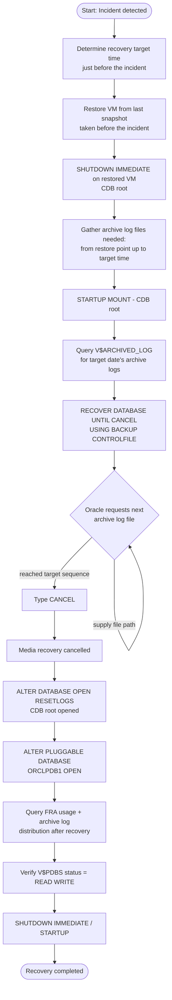
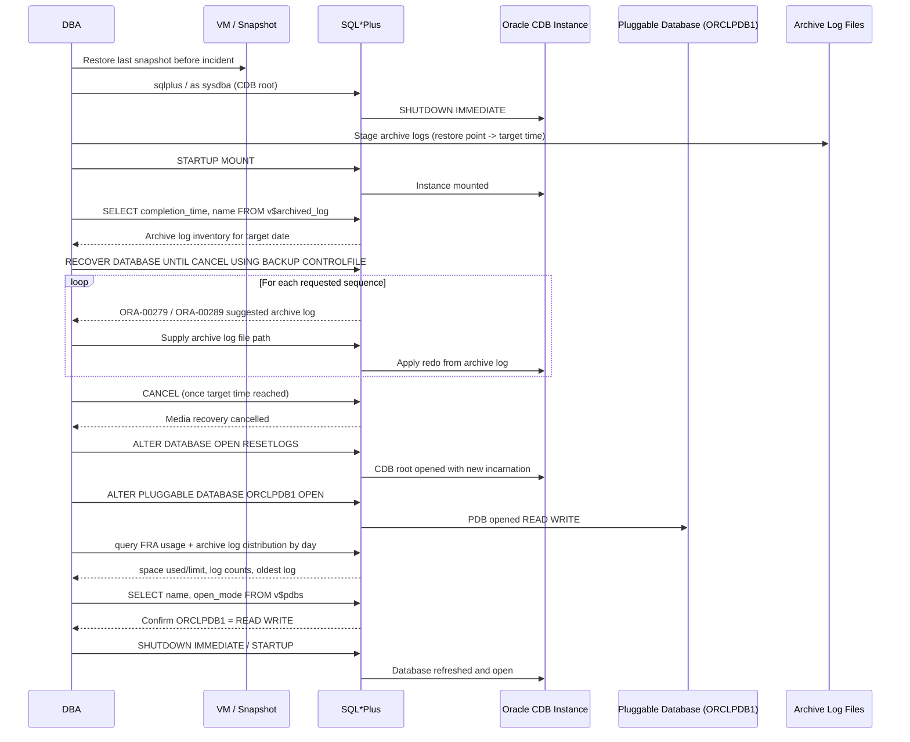

# Recovery Database Before Crash for Oracle Database 19c (ORCLDB) on Ms Windows

This document describes a complete, step-by-step simulation for recovering the `ORCLDB` container database (CDB) to the point in time immediately before a crash or user error (e.g., accidental `DROP TABLE` / `DELETE`), using SQL*Plus and archive log files on Oracle 19c (Windows). The procedure restores the VM from the last snapshot taken before the incident, applies archive logs up to a target time using incomplete recovery (`RECOVER DATABASE UNTIL CANCEL`), and — because 19c uses a multitenant (CDB/PDB) architecture — explicitly opens the affected pluggable database after the CDB root recovery completes.

> **Note:** All host names, SIDs, paths, dates, and credentials shown in this document are placeholders. Replace them with your actual environment values before use.

> **⚠️ This is an incomplete recovery procedure** — `ALTER DATABASE OPEN RESETLOGS` permanently discards any transactions committed after the recovery target time. Always confirm the target time and available archive logs before opening the database.

---

## Scenario Information

| Field                | Value                                                        |
|----------------------|---------------------------------------------------------------|
| Company              | Company Name (Example)                                        |
| Author               | Kusnandar R                                                    |
| Email                | seeomkus@gmail.com                                             |
| Document Date        | 2026-07-14                                                     |
| Database             | Oracle 19c on Microsoft Windows                                   |
| Target               | `ORCLDB` (CDB, container `ORCLPDB1`)                             |
| Database Mode        | `ARCHIVELOG`                                                    |
| Incident              | User error / crash affecting pluggable database `ORCLPDB1`      |
| Incident Time         | `<INCIDENT_DATE> <INCIDENT_TIME>` (example: `2026-07-14 10:30`) |
| Recovery Target Time  | Just before incident time (example: `2026-07-14 10:25`)         |

### Prerequisites

- CDB running in `ARCHIVELOG` mode
- A VM snapshot backup taken **before** the incident occurred
- A complete set of archive log files up to the incident time

---

## Workflow Diagram



## Sequence Diagram — Point-in-Time Recovery Flow (CDB-aware)



---

## Recovery Procedure

### 1. Determine the Target Recovery Time

```
<RECOVERY_TARGET_TIME>   -- e.g. 2026-07-14 10:25:00
```

### 2. Restore VM from the Last Snapshot Before the Incident

```sql
-- After restoring the VM, shut down the Oracle CDB instance on the restored server
sqlplus / as sysdba
SHUTDOWN IMMEDIATE;

-- Stage the archive log files needed for recovery:
-- from the restore point up to just before the incident time,
-- copied from the backup/archive server
```

### 3. Start the CDB in MOUNT Mode

```sql
sqlplus / as sysdba
STARTUP MOUNT;
```

> **Note:** This connects to the CDB root (`CDB$ROOT`). Recovery operations act on the CDB as a whole, including datafiles belonging to pluggable databases.

### 4. Recover Up to the Target Time (CDB in MOUNT State)

```sql
SELECT
    TO_CHAR(COMPLETION_TIME, 'YYYY-MM-DD HH24:MI:SS') AS TIME_COMPLETED,
    NAME
FROM V$ARCHIVED_LOG
WHERE
    TO_CHAR(COMPLETION_TIME, 'YYYY-MM-DD') = '<TARGET_DATE>'
ORDER BY COMPLETION_TIME;
```

```sql
RECOVER DATABASE UNTIL CANCEL USING BACKUP CONTROLFILE;
```

Example prompt/response sequence during recovery:

```
ORA-00279: change <CHANGE_NUM> generated at <DATE> <TIME> needed for thread 1
ORA-00289: suggestion :
<SUGGESTED_ARCHIVE_LOG_PATH>
ORA-00280: change <CHANGE_NUM> for thread 1 is in sequence #<SEQ_N>

Specify log: {<RET>=suggested | filename | AUTO | CANCEL}
```

Supply the archive log path requested by Oracle:

```
<ARCHIVE_LOG_STAGING_PATH>\<ARCHIVE_LOG_FILE_SEQ_N>
```

Repeat for each subsequent sequence number. Once the target recovery time is reached, respond with `CANCEL`:

```
Specify log: {<RET>=suggested | filename | AUTO | CANCEL}
cancel
```

```
Media recovery cancelled.
```

### 5. Open the CDB Root

```sql
ALTER DATABASE OPEN RESETLOGS;
```

### 6. Open the Affected Pluggable Database

```sql
ALTER PLUGGABLE DATABASE ORCLPDB1 OPEN;
```

### 7. Verify the Recovery

```sql
-- Confirm archive log inventory
SELECT
    TO_CHAR(COMPLETION_TIME, 'YYYY-MM-DD HH24:MI:SS') AS TIME_COMPLETED,
    NAME
FROM V$ARCHIVED_LOG
WHERE
    TO_CHAR(COMPLETION_TIME, 'YYYY-MM-DD') = '<TARGET_DATE>'
ORDER BY COMPLETION_TIME;

-- Confirm PDB is open and read/write
SELECT NAME, OPEN_MODE FROM V$PDBS;

-- Enhanced FRA usage check after recovery
SELECT
    SPACE_USED/1024/1024        AS SPACE_USED_MB,
    SPACE_LIMIT/1024/1024       AS SPACE_LIMIT_MB,
    SPACE_RECLAIMABLE/1024/1024 AS SPACE_RECLAIMABLE_MB,
    (SPACE_USED/SPACE_LIMIT)*100 AS PERCENT_USED
FROM V$RECOVERY_FILE_DEST;

-- Refresh the database
SHUTDOWN IMMEDIATE;
STARTUP;
```

If the archive log inventory matches what was supplied during recovery and `ORCLPDB1` shows `READ WRITE`, the point-in-time recovery has completed successfully.

---

## Key Features

- **Point-in-time recovery** — restores the CDB to a specific moment before data loss or corruption occurred
- **CDB-aware** — recovery is performed at the CDB root level; the affected pluggable database must be opened explicitly afterward
- **VM snapshot + archive log combination** — snapshot provides the baseline, archive logs bridge the gap up to the target time
- **`UNTIL CANCEL` control** — allows the DBA to stop recovery precisely at the desired archive log sequence
- **`BACKUP CONTROLFILE` recovery** — used when the current control file does not match the restored datafiles
- **Enhanced FRA verification** — post-recovery checks include FRA space usage (used/limit/reclaimable) alongside archive log inventory and PDB open mode
- **Verification at multiple levels** — archive log inventory, PDB open mode (`V$PDBS`), and FRA usage are all checked after recovery

---

## SQL Queries Used

```sql
-- Check archive log completion status for a target date (CDB level)
SELECT
    TO_CHAR(COMPLETION_TIME, 'YYYY-MM-DD HH24:MI:SS') AS TIME_COMPLETED,
    NAME
FROM V$ARCHIVED_LOG
WHERE TO_CHAR(COMPLETION_TIME, 'YYYY-MM-DD') = '<TARGET_DATE>'
ORDER BY COMPLETION_TIME;

-- Confirm PDB open mode after recovery
SELECT NAME, OPEN_MODE FROM V$PDBS;

-- FRA usage after recovery
SELECT
    SPACE_USED/1024/1024        AS SPACE_USED_MB,
    SPACE_LIMIT/1024/1024       AS SPACE_LIMIT_MB,
    SPACE_RECLAIMABLE/1024/1024 AS SPACE_RECLAIMABLE_MB,
    (SPACE_USED/SPACE_LIMIT)*100 AS PERCENT_USED
FROM V$RECOVERY_FILE_DEST;
```

---

## Design Notes

- In a Container Database (CDB) architecture, `RECOVER DATABASE` and `ALTER DATABASE OPEN RESETLOGS` operate at the **CDB root** level (`CDB$ROOT`), not per-PDB.
- A successful `OPEN RESETLOGS` does **not** automatically bring pluggable databases online — `ALTER PLUGGABLE DATABASE <PDB_NAME> OPEN` is a required, version-specific extra step (same as 12c).
- `UNTIL CANCEL` (rather than `UNTIL TIME '<timestamp>'`) is used so the DBA can visually confirm each archive log sequence before deciding whether to keep applying redo or stop.
- This 19c variant adds a post-recovery FRA usage check (space used/limit/reclaimable) as good practice, since incomplete recovery can leave the FRA in an inconsistent state relative to `V$RECOVERY_FILE_DEST` reporting until the next backup completes.
- `ALTER DATABASE OPEN RESETLOGS` creates a new incarnation of the CDB and invalidates any archive logs generated after the original incident — schedule a fresh full backup of the CDB immediately after recovery completes.

---

## Error Handling / Troubleshooting

| Issue                                   | Action / Solution                                                       |
|------------------------------------------|---------------------------------------------------------------------------|
| Oracle repeatedly requests an archive log that doesn't exist | Verify the archive log staging path and confirm the file was copied from the backup server |
| `RECOVER DATABASE` fails to start        | Confirm CDB is in `MOUNT` state and control file is accessible            |
| Recovered too far past the incident      | Restart recovery from the VM snapshot and stop (`CANCEL`) at an earlier sequence |
| `ALTER DATABASE OPEN RESETLOGS` fails    | Confirm all required archive logs were applied and recovery was properly cancelled |
| PDB remains in `MOUNTED` state after root `OPEN RESETLOGS` | Run `ALTER PLUGGABLE DATABASE <PDB_NAME> OPEN` explicitly |
| Archive log inventory after recovery doesn't match expectation | Investigate whether an intermediate archive log was skipped during the recovery prompts |
| FRA usage report shows unexpected values | Run a fresh full backup after recovery to reconcile FRA reporting        |

---

## Permissions Required

- Oracle `sysdba` access on the restored VM at the CDB root level for `SHUTDOWN`, `STARTUP MOUNT`, `RECOVER DATABASE`, and `ALTER DATABASE OPEN RESETLOGS`
- Privilege to run `ALTER PLUGGABLE DATABASE ... OPEN` on the affected PDB
- Read access to the archive log staging directory on the restored VM
- Read access to `V$RECOVERY_FILE_DEST`, `V$ARCHIVED_LOG`, `V$PDBS`
- Access to the backup/archive server to retrieve archive log files up to the incident time
- VM-level restore permissions to roll back to the pre-incident snapshot

---

> **End of Document**
